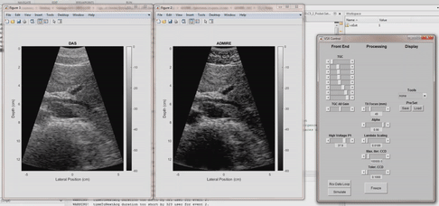

# ADMIRE (Aperture Domain Model Image REconstruction)

## Table of Contents
1. [Overview](#Overview)
2. [CPU Implementation Setup](#CPU-Implementation-Setup)
3. [GPU Implementation Setup](#GPU-Implementation-Setup)
4. [ADMIRE Models Generation User-Defined Parameters](#ADMIRE-Models-Generation-User-Defined-Parameters)
5. [ADMIRE Models Application User-Defined Parameters](#ADMIRE-Models-Application-User-Defined-Parameters)
6. [Input Data Format for Offline Processing of Data](#Input-Data-Format-for-Offline-Processing)
7. [Tutorial #1: Offline Processing of Data](#Tutorial-1-Offline-Processing-of-Data)
8. [Tutorial #2: Real-Time Imaging with ADMIRE Using a Verasonics Vantage Ultrasound Research System](#Tutorial-2-Real-Time-Imaging-with-ADMIRE-Using-a-Verasonics-Vantage-Ultrasound-Research-System)
9. [Additional Notes](#Additional-Notes)
10. [External Code Used in this Repository](#External-Code-Used-in-this-Repository)
11. [License](#License)
12. [Citing this Repository](#Citing-this-Repository)
13. [Contact Information](#Contact-Information)
14. [Acknowledgements](#Acknowledgements)

## Overview
ADMIRE (Aperture Domain Model Image REconstruction) is a model-based approach to ultrasound beamforming. The overview of the method is that ultrasound channel data is first collected and time-delayed. Following this, the short-time Fourier transform (STFT) is taken through the depth dimension for each channel, and the aperture domain data for several frequencies within each STFT window are fit using models. The frequencies that are typically fit correspond to the bandwidth of the ultrasound pulse. Each model consists of the modeled wavefronts, localized in time and frequency, that return to the aperture from different scattering locations. Linear regression with elastic-net regularization is utilized to perform the fits, and the objective function is shown below. This objective function is minimized using the cyclic coordinate descent optimization algorithm.


In this equation,  represents the number of observations,  represents the number of predictors,  is the model matrix containing  predictors with  observations each,  is the vector of  observations to which the model matrix is being fit,  is the vector of  model coefficients,  is a scaling factor for the amount of regularization that is applied, and  is a factor in the range [0, 1] that provides a weighting between the L1-regularization and the L2-regularization terms. Essentially, the purpose of the model fits is to estimate how each scattering location contributes to a given set of aperture domain frequency data. Once the models are fit, the decluttered aperture domain data for each frequency is reconstructed by only using the scattering locations that do not contribute to multipath or off-axis scattering. The inverse short-time Fourier transform (ISTFT) is then taken to obtain the decluttered channel data.

This repository provides code for running ADMIRE using a CPU and running ADMIRE using a GPU. It also includes code for performing real-time imaging with the GPU implementation of ADMIRE using a Verasonics Vantage ultrasound research system. Note that if you do not have a CUDA-capable GPU, then you can only use the CPU implementation. In addition, also note that the code provided is meant for walked aperture scans with focused transmits.

## CPU Implementation Setup
### Requirements
* A computer with Windows or Linux OS (code was tested on systems using these two operating systems, but it could potentially run on macOS as well)
* MATLAB
* C/C++ compiler that is compatible with the release of MATLAB that is being used in order to allow for the compilation of MEX-files containing C/C++ code (compiler compatibility can be found at https://www.mathworks.com/support/requirements/supported-compilers.html) 
  * For Windows, the free community edition of Microsoft Visual Studio 2017 was used as the C/C++ compiler. To download this older version, go to https://visualstudio.microsoft.com/vs/older-downloads/ and create a free Dev Essentials program account with Microsoft. When installing Microsoft Visual Studio 2017, make sure to also check the box for the VC++ 2015 toolset (the 2015 will most likely be followed by a version number). For Linux, the GNU Compiler Collection (GCC) was used as the C/C++ compiler. 
  
### Code Compilation
Once a compiler is installed, you will need to compile the ```ccd_double_precision.c``` file into a MEX-file. This file is used during the model fitting stage of ADMIRE in order to perform linear regression with elastic-net regularization using the cyclic coordinate descent optimization algorithm. Assuming the code repository is already on your system, go to the MATLAB directory that contains the repository folders and add them to your MATLAB path. Following this, go to the ```CPU_Code``` folder. For both Windows and Linux OS, type the following command into the MATLAB command prompt.

```Matlab
mex ccd_double_precision.c
```

In addition, if desired, the ```-v``` flag can be included at the end of the mex command to display compilation details. If the compilation process is successful, then a success message will be displayed in the command prompt, and a compiled MEX-file will appear in the directory. The compilation process is important, and it is recommended to recompile any time a different release of MATLAB is utilized. Note that the ```glmnet``` software package was originally used to perform the model fits, but it was replaced with a custom implementation of cyclic coordinate descent using the C programming language.

## GPU Implementation Setup 
### Requirements
* A computer with Windows or Linux OS (code was tested on systems using these two operating systems, but it could potentially run on macOS as well)
* CUDA-capable NVIDIA GPU (code was tested using an NVIDIA GeForce GTX 1080 Ti GPU, an NVIDIA GeForce GTX 2080 Ti GPU, and an NVIDIA GeForce GTX 1660 Ti laptop GPU)
* MATLAB
* Parallel Computing Toolbox for MATLAB in order to allow for the compilation of MEX-files containing CUDA code
* C/C++ compiler that is compatible with the release of MATLAB that is being used in order to allow for the compilation of MEX-files containing C/C++ code (compiler compatibility can be found at https://www.mathworks.com/support/requirements/supported-compilers.html) 
  * For Windows, the free community edition of Microsoft Visual Studio 2017 was used as the C/C++ compiler. To download this older version, go to https://visualstudio.microsoft.com/vs/older-downloads/ and create a free Dev Essentials program account with Microsoft. When installing Microsoft Visual Studio 2017, make sure to also check the box for the VC++ 2015 toolset (the 2015 will most likely be followed by a version number). For Linux, the GNU Compiler Collection (GCC) was used as the C/C++ compiler. 
* CUDA toolkit that is compatible with the release of MATLAB (compatibility can be found at https://www.mathworks.com/help/parallel-computing/gpu-support-by-release.html)
  * Once the compatibility is determined, go to https://developer.nvidia.com/cuda-toolkit-archive and install the particular CUDA toolkit version. Note that the installation process for the toolkit will also allow for the option to install a new graphics driver. If you do not desire to install a new driver, then you must ensure that your current driver supports the toolkit version that is being installed. For driver and toolkit compatability, refer to page 4 of https://docs.nvidia.com/pdf/CUDA_Compatibility.pdf. 

### MATLAB GPU Check
* Before compiling the files that contain the C/CUDA code into MEX-files, you should first check to see that MATLAB recognizes your GPU card. To do so, go to the command prompt and type ```gpuDevice```. If successful, the properties of the GPU will be displayed. If an error is returned, then possible causes will most likely be related to the graphics driver or the toolkit version that is installed.

### Code Compilation for Windows OS
* Once the GPU is recognized, the next step is to compile the files that contain the C/CUDA code into MEX-files. Assuming the code repository is already on your system, go to the MATLAB directory that contains the repository folders and add them to your MATLAB path. Following this, go to the ```GPU_Code``` folder. For Windows OS, type the following commands into the MATLAB command prompt.
  * The ```-v``` flag can also be included as an argument to each mexcuda command to display compilation details. When included as an argument, it should be wrapped with single quotes like the other arguments. If the compilation process is successful, then it will display a success message for each compilation in the command prompt. In addition, a compiled MEX-file will appear in each folder. The compilation process is important, and it is recommended to recompile any time a different release of MATLAB is utilized.

```Matlab
mexcuda('ADMIRE_GPU_curvilinear_probe_reshaped_data_type.cu', '-lcufft', 'NVCC_FLAGS=-Xptxas -dlcm=ca')
mexcuda('ADMIRE_GPU_curvilinear_probe_verasonics_RF_buffer_data_type.cu', '-lcufft', 'NVCC_FLAGS=-Xptxas -dlcm=ca')
mexcuda('ADMIRE_GPU_linear_probe_reshaped_data_type.cu', '-lcufft', 'NVCC_FLAGS=-Xptxas -dlcm=ca')
mexcuda('ADMIRE_GPU_linear_probe_Verasonics_RF_buffer_data_type.cu', '-lcufft', 'NVCC_FLAGS=-Xptxas -dlcm=ca')
```

### Code Compilation for Linux OS
* Once the GPU is recognized, the next step is to compile the files that contain the C/CUDA code into MEX-files. Assuming the code repository is already on your system, go to the MATLAB directory that contains the repository folders and add them to your MATLAB path. Following this, go to the ```GPU_Code``` folder. For Linux OS, type the following commands into the MATLAB command prompt.
  * These commands are similar to the commands that are used for code compilation for Windows OS, but the path to the CUDA toolkit library must also be included. Note that mexcuda might find the CUDA toolkit library even if you do not explicitly type out its path. In addition, note that there might be differences in your path compared to the one shown above, such as in regards to the version of the CUDA toolkit that is being used. The ```-v``` flag can also be included as an argument to each mexcuda command to display compilation details. When included as an argument, it should be wrapped with single quotes like the other arguments. If the compilation process is successful, then it will display a success message for each compilation in the command prompt. In addition, a MEX-file should appear after each mexcuda call. The compilation process is important, and it is recommended to recompile any time a different release of MATLAB is utilized.

```Matlab
mexcuda('ADMIRE_GPU_curvilinear_probe_reshaped_data_type.cu', '-L/usr/local/cuda-10.0/lib64', '-lcufft', 'NVCC_FLAGS=-Xptxas -dlcm=ca')
mexcuda('ADMIRE_GPU_curvilinear_probe_verasonics_RF_buffer_data_type.cu', '-L/usr/local/cuda-10.0/lib64', '-lcufft', 'NVCC_FLAGS=-Xptxas -dlcm=ca')
mexcuda('ADMIRE_GPU_linear_probe_reshaped_data_type.cu', '-L/usr/local/cuda-10.0/lib64', '-lcufft', 'NVCC_FLAGS=-Xptxas -dlcm=ca')
mexcuda('ADMIRE_GPU_linear_probe_Verasonics_RF_buffer_data_type.cu', '-L/usr/local/cuda-10.0/lib64', '-lcufft', 'NVCC_FLAGS=-Xptxas -dlcm=ca')
```

## ADMIRE Models Generation User-Defined Parameters
In order to apply ADMIRE to ultrasound channel data, the models that ADMIRE uses must be generated. These models are generated using the ```ADMIRE_models_generation_main.m``` script. The script requires several parameters to be specified, and they are described below.

#### These are the parameters that will most likely be frequently changed each time the ADMIRE models are generated.

* ```params.processor_type```: This specifies whether the ADMIRE models that are generated by this script will be applied to channel data using a CPU or a GPU. The two options are either ```params.processor_type = 'CPU'``` or ```params.processor_type = 'GPU'```. Note that the models are always generated using a CPU.

* ```params.data_type```: This specifies the type of data that is being processed. Set ```params.data_type = 'Reshaped'``` if the channel data is in the form (Depths + t0 - 1) x Elements per Beam x Beams x Frames. In this case, t0 is the sample number that corresponds to a depth of 0. If the first sample corresponds to a depth of 0, then t0 is 1. In addition, Frames corresponds to the fact that the matrix can be 4-D, where the fourth dimension indicates the frame of the channel data. ```params.data_type = 'Reshaped'``` should be selected in cases such as when Field II data is being processed or if a Verasonics RF buffer that has already been reshaped is being processed. Now, the other option for this parameter is ```params.data_type = 'Verasonics RF Buffer'```, and this should be used when a raw Verasonics RF data buffer is being processed. The data in this buffer is of type int16. Moreover, it is in the form Buffer Rows x Total Elements On Transducer x Frames because on the Verasonics, all of the transducer elements are used to receive for the RF data buffer. 

* ```params.t0```: This parameter is the axial sample index that corresponds to a depth of 0. For example, when collecting data with a Verasonics system, the first few axial samples for each beam usually need to be cropped out, and ```t0``` is the parameter that is used to do this. The axial samples corresponding to indices less than t0 will be removed. Set ```params.t0 = 1``` when the t0 is already accounted for in the data. Essentially, if ```t0``` is accounted for, then the first axial sample in the data should correspond to a depth of 0.

* ```params.c```: The speed of sound (m/s).

* ```params.num_buffer_rows```: The number of rows per frame in the Verasonics RF buffer. This parameter is not used when ```params.data_type = 'Reshaped'```.

* ```params.num_depths```: The number of depth samples in the channel data after t0 is accounted for.

* ```params.num_elements```: The number of receive elements used to obtain one beam.

* ```params.total_elements_on_probe```: The total number of elements that are on the transducer.

* ```params.num_beams```: The number of beams.

* ```params.f0```: The transducer center frequency (Hz).

* ```params.fs```: The sampling frequency (Hz).

* ```params.BW```: The fractional bandwidth of the transmitted ultrasound pulse. For example, a value for this might be ```params.BW = 0.6```.

* ```params.probe_type```: The type of transducer array that is used. The two options are either ```params.probe_type = 'Linear'``` or ```params.probe_type = 'Curvilinear'```.

* ```params.probe_name```: The name of the transducer array that is used (i.e., ```params.probe_name = 'L7-4'```, ```params.probe_name = 'C5-2'```, etc.). Note that this parameter can be set to any string, and the generation of the ADMIRE model matrices does not depend on it. It is only used for purposes of recordkeeping.

* ```params.probe_radius```: The curved transducer array radius (m). This parameter is not used when ```params.probe_type = 'Linear'```.

* ```params.dtheta```: The angle increment between beams (rad). This parameter is not used when ```params.probe_type = 'Linear'```.

* ```params.probe_pitch```: The pitch of the transducer array (m).

* ```params.start_depth_ADMIRE```: The start depth for applying ADMIRE (m). If the start depth is less than the minimum depth for the scan (assumed to be 0), then the start depth is set to the minimum depth automatically. Note that delay-and-sum is applied to all of the depths that do not have ADMIRE applied to them.

* ```params.end_depth_ADMIRE```: The end depth for applying ADMIRE (m). If the end depth is greater than the maximum depth for the scan, then the end depth is set to the maximum depth automatically. Note that delay-and-sum is applied to all of the depths that do not have ADMIRE applied to them.

* ```params.alpha```: The  value that is used to weight the L1-regularization and L2-regularization terms in elastic-net regularization. The range for this value is [0, 1], and a typical value is ```params.alpha = 0.9```.

* ```params.lambda_scaling_factor```: The scaling factor that is used in the calculation of , which is used in elastic-net regularization. This is the same as , and a typical value is ```params.lambda_scaling_factor = 0.0189```.

* ```params.max_iterations```: The maximum number of iterations of cyclic coordinate descent to perform. If this number of iterations is reached, then cyclic coordinate descent will stop. A typical value is ```params.max_iterations = 100000```.

* ```params.tolerance```: The tolerance convergence criterion for cyclic coordinate descent. Each time a model coefficient is updated, the weighted (all of the observation weights are 1 in this case) sum of squares of the changes in the fitted values due to this update is calculated as , where  is the value of the model coefficient before the update and  is the value of the model coefficient after the update. This will be evaluated for every model coefficient until one iteration of cyclic coordinate descent is completed. The maximum value for this evaluated term is then taken across all of the model coefficients, and it is compared to the specified tolerance value. If the value is less than the tolerance value, then cyclic coordinate descent will stop. However, if it is equal to or greater than the tolerance value, then cyclic coordinate descent will continue. A typical value for ADMIRE with ICA is ```params.tolerance = 0.1```. However, if you are using ADMIRE without ICA, then it might be necessary to set this to a lower value such as ```params.tolerance = 0.0001``` or ```params.tolerance = 0.00001```.

* ```params.ICA_ADMIRE_flag```: The flag that determines whether or not ICA is applied to the ADMIRE model matrices. Set ```params.ICA_ADMIRE_flag = 0``` to not apply ICA or set ```params.ICA_ADMIRE_flag = 1``` for to apply ICA (must set ```params.ICA_ADMIRE_flag = 1``` if ```params.processor_type = 'GPU'```).

* ```params.channel_data_output_flag```: The flag that determines whether or not the ADMIRE processed channel data is outputted. Set ```params.channel_data_output_flag = 0``` to only have the envelope data outputted when the ADMIRE models are applied or set to ```params.channel_data_output_flag = 1``` to have both the envelope data and channel data outputted when the ADMIRE models are applied.

* ```params.aperture_growth_flag```: The flag that determines whether or not aperture growth is applied. Set ```params.aperture_growth_flag = 0``` to not apply aperture growth or set to ```params.aperture_growth_flag = 1``` to apply aperture growth.

* ```params.min_num_elements```: This parameter does not let aperture growth reduce the number of elements below the parameter's value. A typical value is ```params.min_num_elements = 16```. This parameter is not used when ```params.aperture_growth_flag = 0 ```.

* ```params.F_number```: The F number for applying aperture growth. This parameter is not used when ```params.aperture_growth_flag = 0 ```.

* ```params.models_save_path```: The path to the directory in which the generated ADMIRE models are saved.

#### These are the parameters that are recommended to be left unchanged.

* ```params.max_windows_per_set```: The number of windows to group together in one set for the short-time Fourier transform (STFT) calculation on the GPU. It is recommended to set ```params.max_windows_per_set = 17```. This parameter is not used if ```params.processor_type = 'CPU'```.

* ```params.pulse_multiplier```: The scaling factor that is used in the ```params.stft_window_length``` parameter calculation. It is recommended to set ```params.pulse_multiplier = 1```.

* ```params.cal_shift```: The calibration offset (m) that is used for the ```tau_n0``` calculation in the ```generate_modeled_signal_for_predictor.m``` function. It is recommended to set ```params.cal_shift = 7.75E-6```.

* ```params.distance_offset_shift```: The calibration offset (m) that is used for the distance offset in the ```generate_modeled_signal_for_predictor.m``` function. It is recommended to set ```params.distance_offset_shift = 3.85E-5```.

* ```params.win_tune```: The scaling factor that is multiplied by the ```half_pulse_length_distance``` variable in the ```generate_modeled_signal_for_predictor.m``` function. It is recommended to set ```params.win_tune = 1```.

* ```params.ellipsoid_constant_1```: The constant that is used in the ROI model ellipsoidal acceptance region calculation in the ```generate_models_for_stft_window.m``` function. It is recommended to set ```params.ellipsoid_constant_1 = 0```.

* ```params.ellipsoid_constant_2```: The constant that is used in the outer model ellipsoidal acceptance region calculation in the ```generate_models_for_stft_window.m``` function. It is recommended to set ```params.ellipsoid_constant_2 = 0.5E-3 + eps```.

* ```params.lateral_limit_offset```: The calibration offset (m) that is used in calculating the possible lateral positions for the outer model predictors in the ```generate_models_for_stft_window.m``` function. It is recommended to set ```params.lateral_limit_offset = 1E-3```.

* ```params.stft_window_overlap```: The fraction of samples that overlap between short-time Fourier transform (STFT) windows. You must set ```params.stft_window_overlap = 0``` in this code release.

* ```params.gamma_im```: The gamma parameter that is used for intentional modulation. You must set ```params.gamma_im = 0``` in this code release.

* ```params.stft_windowing_function```: The windowing function to use for the short-time Fourier transform (STFT). You must set ```params.stft_windowing_function = @rectwin``` in this code release.

#### These parameters are used to define the model space for ADMIRE in terms of the grids of possible scattering locations for the ROI and outer models. These values can be left unchanged, or they can be modified in order to change the model space sampling.

* ```params.ROI_model_x_position_scaling_factors```: The scaling factors that are used to define the possible lateral positions of the ROI model predictors in the ```generate_models_for_stft_window_function.m``` function. The values that are already in the script are ```params.ROI_model_x_position_scaling_factors = [-0.5, 0.0179, 0.5] ```.

* ```params.ROI_model_z_position_scaling_factors```: The scaling factors that are used to define the possible depth positions of the ROI model predictors in the ```generate_models_for_stft_window.m``` function. The values that are already in the script are ```params.ROI_model_z_position_scaling_factors = [-0.5, 0.1430, 0.5]```.

* ```params.ROI_model_distance_offset_scaling_factor```: The scaling factor that is used to define the possible distance offsets for the ROI model predictors in the ```generate_models_for_stft_window.m``` function. The value that is already in the script is ```params.ROI_model_distance_offset_scaling_factor = [0.0485]```.

* ```params.ROI_model_distance_offset_constants```: The constants that describe the minimum and maximum distance offsets (m) that are used for the ROI model predictors in the ```generate_models_for_stft_window.m``` function. The values that are already in the script are ```params.ROI_model_distance_offset_constants = [-0.8E-3, 0.4E-3]```.

* ```params.outer_model_x_position_scaling_factors```: The scaling factors that are used to define the possible lateral positions for the outer model predictors in the ```generate_models_for_stft_window.m``` function. The values that are already in the script are ```params.outer_model_x_position_scaling_factors = [-1, 1.4228, 1]```.

* ```params.outer_model_z_position_scaling_factors```: The scaling factors that are used to define the possible depth positions of the outer model predictors in the ```generate_models_for_stft_window.m``` function. The values that are already in the script are ```params.outer_model_z_position_scaling_factors = [0, 0, 0.7114, 1, 0, 0.05]```. Note that these values mean that for a given short-time Fourier transform window, the depth range for the grid of scattering locations for the outer model will range from 0 to 1.05 times the center depth of the short-time Fourier transform window. If it is desired to generate models that focus primarily on off-axis scattering and less on reverberation, then the values can be set to ```params.outer_models_z_position_scaling_factors = [1, -0.5, 0.7114, 1, 0.5, 0]``` for example. In this case, the depth range of scattering locations is reduced, so there is a smaller depth range for modeling reverberation. However, potential benefits of this are that it can speed up the generation of the models and reduce the amount of memory required. 

* ```params.outer_model_distance_offset_scaling_factor```: The scaling factor that is used to define the possible distance offsets for the outer model predictors in the ```generate_models_for_stft_window.m``` function. The value that is already in the script is ```params.outer_model_distance_offset_scaling_factor = [0.1211]```.

* ```params.outer_model_z_position_constants```: The constant that is used to define the possible depth positions of the outer model for the predictors in the ```generate_models_for_stft_window.m``` function. The value that is already in the script is 
```params.outer_model_z_position_constants = [0]```.

* ```params.outer_model_distance_offset_constants```: The constants that describe the minimum and maximum distance offsets (m) that are used for the outer model predictors in the ```generate_models_for_stft_window.m``` function. The values that are already in the script are ```params.outer_model_distance_offset_constants = [-8E-3, 3.2E-3]```.

## ADMIRE Models Application User-Defined Parameters
Once the ADMIRE models are generated, ultrasound channel data can be processed with ADMIRE using the ```ADMIRE_models_application_main.m``` script. This script is used for offline processing of data and not real-time processing. The parameters that are user-defined for this script are described below.

* ```apply_params.models_load_path```: The path to the directory from which the generated ADMIRE models are loaded.

* ```apply_params.data_load_path```: The path to the directory in which the channel data is located.

* ```apply_params.filename```: The name of the file that contains the channel data.

* ```apply_params.processed_data_save_path```: The path to the directory in which the data processed with ADMIRE is saved.

* ```apply_params.processed_data_filename```: The name of the file to which the data processed with ADMIRE is saved.

* ```apply_params.processor_type```: This specifies whether the channel data is processed using either the CPU implementation of ADMIRE or the GPU implementation. The two options are either ```apply_params.processor_type = 'CPU'``` or ```apply_params.processor_type = 'GPU'```.

* ```apply_params.probe_type```: The type of transducer array that is used. The two options are either ```apply_params.probe_type = 'Linear'``` or ```apply_params.probe_type = 'Curvilinear'```.

* ```apply_params.data_type```: This specifies the type of data that is being processed. Set ```apply_params.data_type = 'Reshaped'``` if the channel data is in the form (Depths + t0 - 1) x Elements per Beam x Beams x Frames. In this case, t0 is the sample number that corresponds to a depth of 0. If the first sample corresponds to a depth of 0, then t0 is 1. In addition, Frames corresponds to the fact that the matrix can be 4-D, where the fourth dimension indicates the frame of the channel data. ```apply_params.data_type = 'Reshaped'``` should be selected in cases such as when Field II data is being processed or if a Verasonics RF buffer that has already been reshaped is being processed. Now, the other option for this parameter is ```apply_params.data_type = 'Verasonics_RF_buffer'```, and this should be used when a raw Verasonics RF data buffer is being processed. The data in this buffer is of type int16. Moreover, it is in the form Buffer Rows x Total Elements On Transducer x Frames because on the Verasonics, all of the transducer elements are used to receive for the RF data buffer. 

* ```apply_params.display_image_flag```: This flag specifies whether or not to display the log-compressed ultrasound images for each frame of channel data that is processed with ADMIRE. Set ```apply_params.display_image_flag = 0``` to not display the processed images or set ```appply_params.display_image_flag = 1``` to display the processed images.

* ```apply_params.display_caxis_limits```: This vector specifies the caxis limits (dB) to use for displaying the processed ultrasound images with a specific dynamic range. For example, to display the processed images with a dynamic range of 60 dB, set ```apply_params.display_caxis_limits = [-60 0]```. This parameter is only used when ```apply_params.display_image_flag = 1```.

## Input Data Format for Offline Processing of Data
In order to process ultrasound channel data using the ```ADMIRE_models_application_main.m``` script, the channel data must be saved to a file. The channel data should be the only variable that is saved to the file, but the variable name does not matter. In addition, if multiple frames are acquired and the channel data is 4-D, then the script will process each frame with ADMIRE due to the fact that it checks the size of the fourth dimension and loops through each frame. Adding on, the channel data should not be time-delayed/beamformed because the ```ADMIRE_models_application_main.m``` script does this.

## Tutorial #1: Offline Processing of Data
Suppose we have simulated 10 sets of channel data using Field II and that we have assembled the sets into a 4-D matrix called ```channel_data_matrix```. Each set of channel data consists of 2,000 depth samples, 128 elements, and 128 beams, which means that the dimensions for ```channel_data_matrix``` are 2,000 x 128 x 128 x 10. Moreover, a linear probe was used for the simulation, and we want to process this data using the GPU implementation of ADMIRE. Due to the fact that the data was simulated using Field II, the magnitude of the data is very small. Therefore, it is recommended to multiply this data by a scaling factor. This is only necessary when Field II simulated data is being processed on the GPU because single precision is used on the GPU. Essentially, multiplying by a scaling factor prevents the reduced precision from becoming a problem due to the small magnitude of the data. To re-emphasize, this does not need to be done when data such as Verasonics data is being processed with the GPU because the magnitude of this data is typically not very small like Field II simulated data. Moreover, this does not have to be done when using the CPU implementation of ADMIRE because double precision is used for these calculations. Now, in terms of the scaling factor, ```1E25``` is one example value that can be used. We can apply this to the data by doing the following below.

```Matlab
channel_data_matrix = channel_data_matrix .* 1E25;
```

Once the data is scaled, we will save it to a file named ```channel_data_for_ADMIRE.mat```. Following this, the ADMIRE models that are required for processing the channel data with ADMIRE must be generated. To do so, we will use the ```ADMIRE_models_generation_main.m``` script. As previously stated, this script requires several parameters to be defined by the user. We will define these parameters as shown below. Note that we indicate which parameters are not required for this case.

```Matlab
params.processor_type = 'GPU'; % This is set to 'GPU' because we want to use the GPU implementation of ADMIRE
params.data_type = 'Reshaped'; % This is set to 'Reshaped' because channel_data_matrix is in the form (Depths + t0 - 1) x Elements per Beam x Beams x Frames
params.t0 = 1; % This is set to 1 because the first depth sample corresponds to a depth of 0
params.c = 1540; % This is set to 1540 because this was the speed of sound that was used in Field II
params.num_buffer_rows = 0; % This parameter does not matter due to the fact that params.data_type = 'Reshaped', so it is just set to a random number
params.num_depths = 2000; % This is set to 2000 because this is the number of depth samples after params.t0 is accounted for (params.t0 is just 1 in this case)
params.num_elements = 128; % This is set to 128 because this is how many elements there are per beam
params.total_elements_on_probe = 256; % This is set to 256 because the probe that was simulated had 256 total elements
params.num_beams = 128; % This is set to 128 because this is how many beams there are
params.f0 = 5.8125E6; % This is set to 5.8125E6 because this was the transducer center frequency that was used in Field II
params.fs = 23.25E6; % This is set to 23.25E6 because this was the sampling frequency that was used in Field II
params.BW = 0.6; % This is set to 0.6 because that was the fractional bandwidth of the excitation pulse that was used in Field II
params.probe_type = 'Linear'; % This is set to 'Linear' because a linear probe was simulated in Field II
params.probe_name = 'Field II Linear Transducer Array'; % This parameter is just used for purposes of recordkeeping and can be set to any string
params.probe_radius = 0; % This parameter is not used due to the fact that params.probe_type = 'Linear', so it is just set to a random number
params.dtheta = 0; % This parameter is not used due to the fact that params.probe_type = 'Linear', so it is just set to a random number
params.probe_pitch = 1.953E-4; % This is set to 1.953E-4 because this was the pitch of the probe that was simulated in Field II
params.start_depth_ADMIRE = 0; % This is set to 0 because we want ADMIRE to start being applied at a depth of 0
params.end_depth_ADMIRE = 10; % This is set to 10 because we want to apply ADMIRE through the full depth range of the data (note that the channel data does not go to a depth of 10 m, but we are just taking advantage of the fact that the code will automatically change this to the maximum depth of the data if the value entered exceeds it)
params.alpha = 0.9; % This is set to 0.9 because we want this alpha value for elastic-net regularization
params.lambda_scaling_factor  = 0.0189; % This is set to 0.0189 because this is the scaling factor that we want to use for the calculation of lambda for elastic-net regularization
params.max_iterations = 100000; % This is set to 100000 because we want this to be the maximum for the number of iterations of cyclic coordinate descent that are performed
params.tolerance = 0.1; % This is set to 0.1 because this is the tolerance convergence criterion that we want to use for cyclic coordinate descent
params.ICA_ADMIRE_flag = 1; % This is set to 1 because we want to apply ICA to the ADMIRE model matrices
params.channel_data_output_flag = 1; % This is set to 1 because we want the ADMIRE-processed channel data to be outputted along with the image data
params.aperture_growth_flag = 1; % This is set to 1 because we want to apply aperture growth
params.min_num_elements = 16; % This is set to 16 because we do not want aperture growth to reduce the number of elements to less than 16
params.F_number = 2; % This is set to 2 because we want to use an F number of 2 for aperture growth
params.models_save_path = 'enter path here'; % This should be set to the path to the directory in which we want the generated ADMIRE models to be saved
```

Note that for the rest of the parameters, we will use the values that are already in the script. Once the parameters are defined, we will run the script within MATLAB. The progress of the script will be displayed in the MATLAB command prompt. This script will generate a model for each frequency that is to be fit in each short-time Fourier transform (STFT) window. The models only need to be generated once and not per beam because all of the beams use the same aperture domain models. In addition, due to the fact that we selected the GPU implementation of ADMIRE, the models will also be organized in the format that the GPU implementation expects.

After the script completes, we will use the ```ADMIRE_models_application_main.m``` script to process the channel data with ADMIRE. As previously stated, this script requires several parameters to be defined by the user, and we will define them as shown below.

```Matlab
apply_params.models_load_path = 'enter path here'; % This should be set to the path to the directory in which the generated ADMIRE models are saved
apply_params.data_load_path = 'enter path here'; % This should be set to the path to the directory in which the channel data is saved (in this case, it is the path to the directory in which the channel_data_for_ADMIRE.mat file is saved)
apply_params.filename = 'channel_data_for_ADMIRE.mat'; % This is set to 'channel_data_for_ADMIRE.mat' because that is the name of the file to which we saved channel_data_matrix
apply_params.processed_data_save_path = 'enter path here'; % This should be set to the path to the directory in which the ADMIRE-processed data is saved
apply_params.processed_data_filename = 'ADMIRE_processed_data.mat'; % This should be set to the name of the file to which the ADMIRE-processed data is saved (in this case, we will name the file 'ADMIRE_processed_data.mat')
apply_params.processor_type = 'GPU'; % This is set to 'GPU' because we want to use the GPU implementation of ADMIRE
apply_params.probe_type = 'Linear'; % This is set to 'Linear' because a linear probe was simulated in Field II
apply_params.data_type = 'Reshaped'; % This is set to 'Reshaped' because channel_data_matrix is in the form (Depths + t0 - 1) x Elements per Beam x Beams x Frames
apply_params.display_image_flag = 1; % This is set to 1 because we want to display the ADMIRE-processed image for each frame of channel data
apply_params.display_caxis_limits = [-60 0]; % This is set to [-60 0] because we want to display the ADMIRE-processed images with a dynamic range of 60 dB
```

Once the parameters are defined, we will run the script within MATLAB. This script will apply ADMIRE to every frame of channel data. The progress of the script will be displayed in the MATLAB command prompt. Upon completion of the script, 10 images will appear corresponding to the ADMIRE-processed images for the 10 frames of channel data. In addition, the ```ADMIRE_processed_data.mat``` file will be saved in the specified directory. This file will contain 4 variables. One variable is called ```envelope_matrix```, which contains the log-compressed image data for each frame of channel data. Note that if ```params.probe_type = 'Curvilinear'```, ```envelope_matrix``` will contain the log-compressed image data that has been scan-converted for each frame of channel data. Two other variables are ```axial_positions_cm``` and ```lateral_positions_cm```, which correspond to the axial positions in cm and the lateral positions in cm for the images. In addition, the fourth variable is ```reconstructed_channel_data```, which contains the ADMIRE-processed channel data for each frame. Note that this variable is only saved out if ```params.channel_data_output_flag = 1```. If you would like to display the ADMIRE-processed images at a later time, you can load in the file containing the data and type the below commands into the MATLAB command prompt. Note that this example shows how to display the first image frame.

```Matlab
frame_number = 1;
figure;
imagesc(lateral_positions_cm, axial_positions_cm, envelope_matrix(:, :, :, frame_number));
colormap gray;
caxis([-60 0]);
axis image;
```

## Tutorial #2: Real-Time Imaging with ADMIRE Using a Verasonics Vantage Ultrasound Research System
In order to perform real-time imaging with ADMIRE on a Verasonics Vantage ultrasound research system, two Verasonics scripts are provided. These scripts are called ```SetUpL7_4_RyLns_ADMIRE.m``` and ```SetUpC5_2_RyLns_ADMIRE.m```, and they were tested on a Verasonics Vantage 128 ultrasound research system. The first script performs walked aperture scans using an L7-4 linear transducer array, and the second script performs walked aperture scans using a C5-2 curvilinear transducer array. Now, it is important to emphasize that real-time imaging with ADMIRE should also be able to be performed using other linear or curvilinear probes as long a walked aperture scan is being performed. However, this would require adapting the sequence acquisition scripts to these other probes, but the actual GPU implementation of ADMIRE should not have to be modified. In this example, we will demonstrate how to perform real-time imaging using the C5-2 curvilinear transducer array. We will start by opening up the ```SetUpC5_2_RyLns_ADMIRE.m``` script. Below, you will see some of the parameters in this script.

```Matlab
% Define P structure
P.startDepth = 0;                 % Start depth for acquisition (wavelengths)
P.endDepth = 300;                 % End depth for acquisition (wavelengths)
P.txFocus = 236;                  % Initial transmit focus (wavelengths)
P.numTx = 65;                     % Number of transmit elements in TX aperture (where possible)
P.num_beams = 128 - P.numTx + 1;  % Number of beams (walked aperture)
P.numFrames = 1;                  % Number of frames in RcvBuffer

% Define initial values for adjustable ADMIRE parameters 
alpha = 0.9;                      % Alpha for elastic-net regularization
lambda_scaling_factor = 0.0189;   % Lambda scaling factor used to scale lambda for elastic-net regularization
max_iterations = 1E5;             % Maximum number of cyclic coordinate descent iterations to perform (convergence criterion)
tolerance = 0.1;                  % Maximum weighted (observation weights are all 1 in this case) sum of squares of the changes in the fitted values between iterations of cyclic coordinate descent (convergence criterion)
```

Note that the GPU implementation of ADMIRE assumes that the first depth sample after accounting for t0 corresponds to a depth of 0. Therefore, it is recommended to leave ```P.startDepth = 0```. In addition, notice that the number of beams to acquire for each frame is automatically calculated based off of the number of transmit elements that are used. This is due to the fact that this script assumes a walked aperture scan. For example, when ```P.numTx = 65```, the first transmit will use the first 65 elements on the C5-2 transducer array. Then, the second transmit will use 65 elements as well, but the specific elements that are used are elements 2-66 on the transducer array. Essentially, with each subsequent transmit, the active aperture shifts over by one element. Now, aside from these parameters, ```alpha```, ```lambda_scaling_factor```, ```max_iterations```, and ```tolerance``` are also shown, which are parameters that are used for ADMIRE. The values shown are the default values that are used when the Verasonics sequence is started. However, they can be changed during real-time imaging using the Verasonics GUI controls. To run this script, the models that ADMIRE uses to process the ultrasound data must be generated. For a given set of sequence parameters, these models only have to be generated once, and after this, they can be reused. However, if sequence parameters such as ```P.endDepth```, ```P.txFocus```, ```P.numTx```, ```P.num_beams```,    ```Resource.Parameters.speedOfSound```, ```Trans.frequency```, or ```'sampleMode'``` are changed, then the ADMIRE models will have to be generated again. 

As previously stated, these models are generated using the ```ADMIRE_models_generation_main.m``` script. This script requires a number of parameters, and additional scripts are provided to determine some of them based off of the Verasonics sequence scripts. These scripts are ```ADMIRE_linear_probe_verasonics_parameters_calculation.m``` and ```ADMIRE_curvilinear_probe_verasonics_parameters_calculation.m```. Note that these scripts are only meant for Verasonics imaging and not offline processing. The second script is the one that we will use for the C5-2 transducer array. Opening this script up, you can see that it utilizes a file called  ```'Dataset_Curvilinear_Probe.mat'```. This file contains several variables pertaining to the Verasonics sequence, and it is generated by another function. This function is called ```gpu_processing_curvilinear_probe.m```. Note that the function for the L7-4 transducer array is called ```gpu_processing_linear_probe.m```. These two functions are the external processing routines that are called as part of each Verasonics sequence in order to process the data on the GPU with ADMIRE. Opening up the ```gpu_processing_curvilinear_probe.m``` function, you can see that one portion of the code has a block comment. We will uncomment this code block and comment the rest of the code. Essentially, we are doing this because we want to save out the ```Dataset_Curvilinear_Probe.mat``` file. Once this block is uncommented and the rest of the code is commented, we can go back to the ```SetUpC5_2_RyLns_ADMIRE.m``` script. Once this script is open, we will run it. This will run the Verasonics sequence, but it will not perform ADMIRE processing because we commented those lines out. Instead, you should see the ```Dataset_Curvilinear_Probe.mat``` file appear in the MATLAB directory. Once this appears, we can freeze the script and stop running it. Following this, we will open the ```ADMIRE_curvilinear_probe_verasonics_parameters_calculation.m``` script, enter the path for ```data_path```, and run the script. Once the script is finished, we will be able to see the parameters for generating the ADMIRE models in the MATLAB workspace. Do not clear the workspace because we need it for the next step. Note that the ```BW``` parameter corresponds to the Verasonics transducer bandwidth, which has a default value of 60% (0.6). If you change this in the Verasonics script, then you will have to account for this by changing ```BW```. Once we have the parameters provided by the ```ADMIRE_curvilinear_probe_verasonics_parameters_calculation.m``` script, we will open up the ```ADMIRE_models_generation_main.m``` script in order to enter the parameter values. An example of this is shown below.

```Matlab
params.processor_type = 'GPU'; % This is set to 'GPU' because we want to use the GPU implementation of ADMIRE
params.data_type = 'Verasonics RF Buffer'; % This is set to 'Verasonics RF Buffer' because the data is of type int16 and in the form Buffer Rows x Total Elements On Transducer x Frames
params.t0 = 20; % This is set to 20 because this is the depth sample that corresponds to a depth of 0
params.c = 1540; % This is set to 1540 because we want to use this as the speed of sound in the medium
params.num_buffer_rows = 139264; % This is set to 139264 because this is the number of rows in the Verasonics RF buffer
params.num_depths = 2157; % This is set to 2157 because this is the number of depth samples after params.t0 is accounted for 
params.num_elements = 65; % This is set to 65 because this is how many elements there are per beam
params.total_elements_on_probe = 128; % This is set to 128 because the C5-2 transducer array has this many total elements
params.num_beams = 64; % This is set to 64 because this is how many beams are acquired
params.f0 = 3.125E6; % This is set to 3.125E6 because this is the transducer center frequency that is specified in the Verasonics sequence script
params.fs = 12.5E6; % This is set to 12.5E6 because this is the sampling frequency that is specified in the Verasonics sequence script
params.BW = 0.6; % This is set to 0.6 because the default transducer bandwidth for the Verasonics system is 60% (0.6)
params.probe_type = 'Curvilinear'; % This is set to 'Curvilinear' because the C5-2 transducer array is a curvilinear transducer
params.probe_name = 'C5-2'; % This parameter is just used for purposes of recordkeeping and can be set to any string
params.probe_radius = 0.0412; % This is set to 0.0412 because this is the C5-2 transducer array radius (m)
params.dtheta = 0.0103; % This parameter is set to 0.0103 because this is the angle increment between beams (rad) 
params.probe_pitch = 4.2456E-4; % This is set to 4.2456E-4 because this is the pitch of the C5-2 transducer array
params.start_depth_ADMIRE = 0; % This is set to 0 because we want ADMIRE to start being applied at a depth of 0
params.end_depth_ADMIRE = 10; % This is set to 10 because we want to apply ADMIRE through the full depth range of the data (note that the channel data does not go to a depth of 10 m, but we are just taking advantage of the fact that the code will automatically change this to the maximum depth of the data if the value entered exceeds it)
params.alpha = 0.9; % This is set to 0.9 because we want this alpha value for elastic-net regularization (note that this will be redefined by the Verasonics sequence as previously mentioned)
params.lambda_scaling_factor  = 0.0189; % This is set to 0.0189 because this is the scaling factor that we want to use for the calculation of lambda for elastic-net regularization (note that this will be redefined by the Verasonics sequence as previously mentioned)
params.max_iterations = 100000; % This is set to 100000 because we want this to be the maximum for the number of iterations of cyclic coordinate descent that are performed (note that this will be redefined by the Verasonics sequence as previously mentioned)
params.tolerance = 0.1; % This is set to 0.1 because this is the tolerance convergence criterion that we want to use for cyclic coordinate descent (note that this will be redefined by the Verasonics sequence as previously mentioned)
params.ICA_ADMIRE_flag = 1; % This is set to 1 because we want to apply ICA to the ADMIRE model matrices
params.channel_data_output_flag = 0; % This is set to 0 because we don't want the channel data to be outputted (we only want the ADMIRE-processed image data for real-time imaging)
params.aperture_growth_flag = 0; % This is set to 0 because we do not want to apply aperture growth
params.min_num_elements = 0; % This parameter is not used due to the fact that params.aperture_growth_flag = 0, so it is just set to a random number
params.F_number = 0; % This parameter is not used due to the fact that params.aperture_growth_flag = 0, so it is just set to a random number
params.models_save_path = 'enter path here'; % This should be set to the path to the directory in which we want the generated ADMIRE models to be saved
```

After the parameters are entered, we will run the script in order to generate the ADMIRE models. Due to the fact that we selected the GPU implementation of ADMIRE, the models will also be organized in the format that the GPU implementation expects. These generated models will be stored in the specified directory. In addition, this directory will contain a file called ```'ADMIRE_Variables_Curvilinear_Probe_Verasonics_RF_Buffer_Data_Type.mat'```, which contains the ADMIRE model matrices in the format that the GPU expects. We can then move this file into the same directory as the Verasonics sequence script. Once moved, we will open the ```gpu_processing_curvilinear_probe.m``` function again. This time, we will comment the block of code that we had previously uncommented. Moreover, we will uncomment the lines that we had previously commented because we now want to perform ADMIRE processing. After doing this, we will open the ```SetUpC5_2_RyLns_ADMIRE.m``` script and run it by clicking the ```Run``` GUI icon in the MATLAB command window. This will start the Verasonics sequence, and an example video of an abdominal scan being performed with the sequence is shown below. The frame rate for this video is approximately 5 frames per second, and ADMIRE processing was performed using an NVIDIA GeForce RTX 2080 Ti GPU. Note that DAS processing was performed in order to simultaneously display the DAS images for reference, but running the code that is provided in this repository will only perform  real-time imaging with ADMIRE.


<p align="center">
  
</p>


## Additional Notes
1. When generating the ADMIRE models using the ```ADMIRE_models_generation_main.m``` script, the progress is displayed in the MATLAB command window. In some cases, such as when not applying aperture growth, a warning may appear for the models for the first few short-time Fourier transform windows. This warning will be regarding the model matrix being singular. If you see this, then it is recommended to let the script run until the first window for which the warning does not occur is determined. Once this happens, the script should be terminated. Following this, enter the folder that was specified for the generated ADMIRE models to be saved in. In this folder, select any of the models for the last short-time Fourier transform window for which the warning occurred. Load the data file into the MATLAB workspace and look at the ```params.depths_in_window``` parameter. Note the last depth value in this array. After this, repeat this step for any of the models for the first short-time Fourier transform window for which the warning did not occur. However, in this case, note the first depth value in the array. Once both values are determined, change the ```params.start_depth_ADMIRE``` parameter in the ```ADMIRE_models_generation_main.m``` script to a value that is in between these two values and run the script again. The warning should not be seen with this change. Note that as previously stated, DAS is applied by default to the depths that do not have ADMIRE applied to them.

2. As previously stated, the parameters that determine the ADMIRE model space can be changed, but the default parameters can also be utilized. The ```params.outer_model_z_position_scaling_factors``` parameter is set to ```params.outer_model_z_position_scaling_factors = [0, 0, 0.7114, 1, 0, 0.05]``` by default. Depending on how much RAM is available on the computer that is used to generate the ADMIRE models, using this setting can potentially cause an out of memory error within MATLAB. If this is the case, then the parameter can be set to ```params.outer_models_z_position_scaling_factors = [1, -0.5, 0.7114, 1, 0.5, 0]```. These new values will reduce the depth range of the scattering locations that are used in each ADMIRE model, which will reduce the amount of RAM required to generate the ADMIRE models and will also speed up the process. Note that the parameter does not have to be set to these values, but these values have been tested. If there is still not enough memory, then the model space parameters can be further changed to make models with less scattering locations. However, depending on the model space that is used, the results with ADMIRE in regard to image quality may vary.

3. If the CPU implementation of ADMIRE requires a large amount of processing time, then one way to speed it up is to edit the ```generate_models_for_stft_window.m``` script. In particular, the very last line of the file can be edited to what is shown below. The scripts are set up to save out the information regarding the positions of the scattering locations that are used to generate each ADMIRE model matrix (if ICA is used, then the information is for the scattering locations before ICA). However, by changing the save statement, this information is not saved out. Therefore, the amount of time that is required to load each of these files is reduced when applying ADMIRE on the CPU. Note that further speedup can be achieved if the ```'-v7.3'``` flag is removed as well because file compression will not be performed with the tradeoff of the file taking up more computer hard drive space.

```Matlab
save(fullfile(params.models_save_path, filename), '-v7.3', 'combined_model', 'params');
```

4. Note that the CPU implementation of ADMIRE in this repository is not the one that was used in the paper "A Real-Time, GPU-Based Implementation of Aperture Domain Model Image REconstruction". The CPU implementation used in the paper loaded all of the ADMIRE parameters for all of the model fits into memory at once in order to provide a more fair comparison with the GPU implementation of ADMIRE. This means that different beams could use the same model matrices for a given short-time Fourier transform window without loading in a file multiple times. The implementation in this repository is more flexible in terms of memory usage due to the fact that all of the ADMIRE parameters for all of the model fits are not loaded at once. Instead, the fits are looped through and only the information required for the current fit is loaded into memory. However, this results in a performance penalty due to the fact that even though different beams can use the same model matrices for a given window, the memory still needs to be reloaded each time. This version was provided in the repository because loading in all of the ADMIRE parameters at once will most likely cause an out of memory error in cases such as when ICA is not used. The case presented in the paper used ICA, so the other version of the code could be utilized. Essentially, the version in this repository requires a greater amount of computational time, but it is more generalizable. 

5. When performing real-time imaging with ADMIRE on a Verasonics Vantage ultrasound research system, a Verasonics GUI control that allows for the transmit focus to be updated in real-time is provided. It is important to note that the calculation of the ```params.t0``` parameter depends upon the transmit focus, so it is recommended to not update the transmit focus in real-time. This is because the ```params.t0``` parameter is calculated and used in the ```ADMIRE_models_generation_main.m``` script to generate the parameters that are utilized during real-time imaging as previously described. If a different transmit focus is desired, then it is recommended to update the transmit focus, calculate the new value for ```params.t0```, and run the ```ADMIRE_models_generation_main.m``` script again. If the transmit focus is updated in real-time, then the value for ```params.t0``` that was previously used in the ```ADMIRE_models_generation_main.m``` script will most likely not be valid anymore. Therefore, this may cause degradation in image quality.

## External Code Used in this Repository
1. The code contained in the ```ica.m``` function was obtained from the paper "A Tutorial on Independent Component Analysis" by Jonathon Shlens. This paper is publicly available on arXiv.org and can be accessed at https://arxiv.org/pdf/1404.2986.pdf. In terms of the license, the submitter granted arXiv.org a perpetual, non-exclusive license to distribute the article. The citation for the paper is listed in the [Citing this Repository](#Citing-this-Repository) section.

2. The ```scmap.m``` and ```sconvert.m``` functions were originally written by Stephen Hsu and included in this repository with his permission. These files were further modified by Christopher Khan. Refer to the files for descriptions of the modifications.

## License
For copyright information, please refer to the [NOTICE](NOTICE) file.

This is free software made available under the Apache License, Version 2.0. For details, refer to the [LICENSE](LICENSE) file. In addition, as described in the [External Code Used in this Repository](#External-Code-Used-in-this-Repository) section, the code for the ```ica.m``` function was obtained from the paper "A Tutorial on Independent Component Analysis" by Jonathon Shlens, which is available on arXiv.org. In terms of the license, the submitter granted arXiv.org a perpetual, non-exclusive license to distribute the article.

## Citing this Repository
Please include the following citations to cite this repository in publications.

```
@article{dei_schlunk_byram_2019, 
	title={Computationally Efficient Implementation of Aperture Domain Model Image Reconstruction}, 
	volume={66}, 
	DOI={10.1109/tuffc.2019.2924824}, 
	number={10}, journal={IEEE Transactions on Ultrasonics, Ferroelectrics, and Frequency Control}, 
	author={{Dei}, K. and {Schlunk}, S. and {Byram}, B.}, 
	year={2019}, 
	pages={1546–1559}
}

@article{byram_dei_tierney_dumont_2015, 
	title={A model and regularization scheme for ultrasonic beamforming clutter reduction}, 
	volume={62}, 
	DOI={10.1109/tuffc.2015.007004}, 
	number={11}, 
	journal={IEEE Transactions on Ultrasonics, Ferroelectrics, and Frequency Control}, 
	author={{Byram}, B. and {Dei}, K. and {Tierney}, J. and {Dumont}, D.}, 
	year={2015}, 
	pages={1913–1927}
}

@article{byram_jakovljevic_2014, 
	title={Ultrasonic multipath and beamforming clutter reduction: a chirp model approach}, 
	volume={61},
	DOI={10.1109/tuffc.2014.2928}, 
	number={3}, 
	journal={IEEE Transactions on Ultrasonics, Ferroelectrics, and Frequency Control}, 
	author={{Byram}, B. and {Jakovljevic}, M.}, 
	year={2014}, 
	pages={428–440}
}

@article{DBLP:journals/corr/Shlens14d,
	author    = {Jonathon Shlens},
  	title     = {A Tutorial on Independent Component Analysis},
  	journal   = {CoRR},
  	volume    = {abs/1404.2986},
  	year      = {2014},
  	url       = {http://arxiv.org/abs/1404.2986},
  	archivePrefix = {arXiv},
  	eprint    = {1404.2986},
  	timestamp = {Mon, 13 Aug 2018 16:46:15 +0200},
  	biburl    = {https://dblp.org/rec/journals/corr/Shlens14d.bib},
  	bibsource = {dblp computer science bibliography, https://dblp.org}
}
```
Please also cite the paper "A Real-Time, GPU-Based Implementation of Aperture Domain Model Image REconstruction", which is currently in press and can be found at https://ieeexplore.ieee.org/document/9344672.

## Contact Information
If you have questions, suggestions, or bugs to report, please use the Issues section of this repository or contact Christopher Khan (christopher.m.khan@vanderbilt.edu).

## Acknowledgements
This work was supported by NIH grants R01EB020040 and S10OD016216-01, NAVSEA grant N0002419C4302, and NSF award IIS-1750994.
